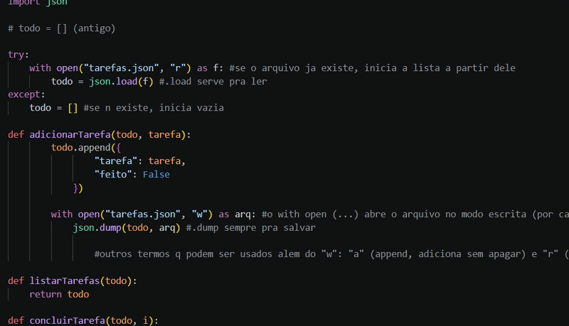
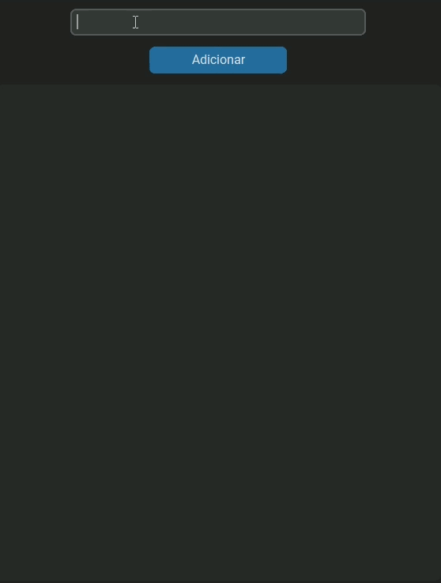

# To-Do List em Python
Este projeto é uma aplicação simples de lista de tarefas desenvolvida em Python, semelhante ao meu projeto de Java. Com foco em praticar lógica de programação, manipulação de dados e construção de interfaces gráficas.

A ideia surgiu inicialmente como parte do meu repositório de estudos ([`python-learning`](https://github.com/lorenzzop/python-learning)) onde venho praticando desde conceitos básicos até estruturas mais avançadas da linguagem.  
O projeto começou como um exercício simples em terminal, com operações básicas como adicionar, listar e remover tarefas. Durante a evolução, ao implementar o sistema de persistência de dados utilizando arquivos JSON, surgiu a ideia de transformar esse exercício em algo mais completo.

---

# Como funciona

O sistema permite gerenciar tarefas de forma simples, com as seguintes funcionalidades principais:

> Adicionar tarefas: o usuário pode inserir uma nova tarefa através do campo de texto.  
> Listar tarefas: todas as tarefas são exibidas na interface, com indicação visual de status.  
> Concluir tarefas: é possível marcar uma tarefa como concluída, alterando seu estado.  
> Remover tarefas: tarefas podem ser excluídas da lista a qualquer momento. 

Cada tarefa é representada internamente como um dicionário, contendo:
- o texto da tarefa
- um valor booleano indicando se foi concluída (True ou False)

Exemplo:

>{  
    "tarefa": "Estudar Python",  
    "feito": False  
} 

# Persistência de dados

Para garantir que as tarefas não sejam perdidas ao fechar o programa, foi implementado um sistema de persistência utilizando arquivos JSON.  
Ao iniciar o programa, o sistema tenta carregar as tarefas a partir do arquivo tarefas.json.
Caso o arquivo não exista, uma lista vazia é criada.
Sempre que uma tarefa é adicionada, concluída ou removida, o arquivo é atualizado automaticamente.

Esse processo é feito utilizando o módulo json do Python:

>json.load() para ler os dados  
json.dump() para salvar as alterações

Isso permite que o estado da aplicação seja mantido entre execuções, simulando o comportamento de um sistema real.

# Interface

Sem dúvidas, a parte mais desafiadora do projeto foi o desenvolvimento da interface. Diferente da lógica em terminal, trabalhar com interfaces exige uma forma diferente e mais complexa de pensar, envolvendo organização visual, interação com o usuário e atualização dinâmica dos elementos na tela.  
Durante esse processo, utilizei tkinter e customtkinter, o que me permitiu entender melhor como funciona a construção de interfaces em Python, mas também deixou claro que ainda há bastante espaço para evolução nessa área.